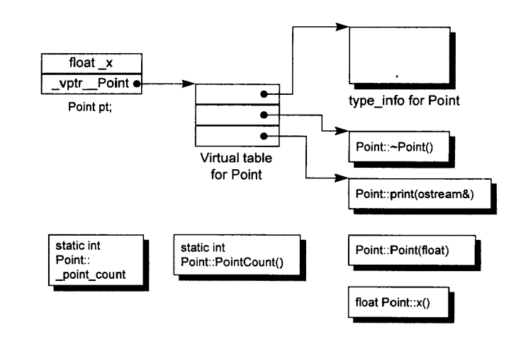

# 一、关于对象
* 封装的时空成本主要来源于virtual机制，包括：  
    1. virtual function : 以支持“运行期绑定”(runtime binding)
    2. virtual base class : 以实现多重继承 
- - -
## C++对象模型

* nonstatic data members 被存放在每个class object之内， static data members则被存放在class object外。
* 每个包含virtual function或基类具有virtual function的类对象会生成指向这些functions的指针，并放在表中，这个表被称为virtual table(vtbl)。
* 同时这些类对象会被插入一个指针，以指向相关的vtbl。  
*(书中指出，vtbl会在表头安插一个*type_info*来支持RTTI，但当前流行编译器生成的vtbl通常并非如此布局)*  
*继承、多重继承和virtual继承的内存布局在第三章给出*
- - - 
## 关键字带来的差异
* struct是为了兼容C语言而保留，作为**类关键字**时，除了默认成员访问和默认基类访问之外，与class等同。*(当声明某个类时，若与定义时关键字不同，某些编译器会进行警告)*
* C++中处于一个access section的数据保证以声明顺序出现在内存中，但多个access section和从基类继承而来数据成员的内存布局并没有强制规定。
- - -
## 对象的差异
*一些多态和内存布局的内容，较为浅显。*
